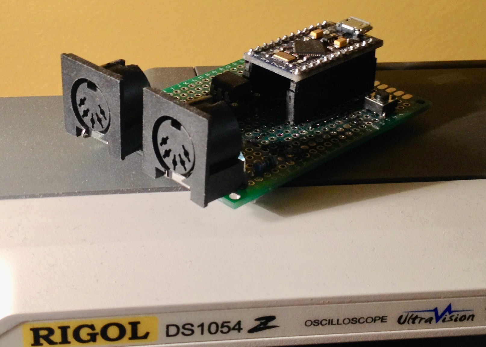

# MIDIUSB_1x1
MIDI Interface 1 in 1 out based on Arduino MidiUSB (https://github.com/arduino-libraries/MIDIUSB) and Midi (https://github.com/FortySevenEffects/arduino_midi_library) libraries

Currently tested on (Pro) micro, Leonardo platforms, but should also work on Due.

Works with iPad and ios native midi drivers (must patch MidiUSB power settings as instructed in the .ino file)

License: GPL V3 © 2016 Fabien (https://github.com/fab672000)